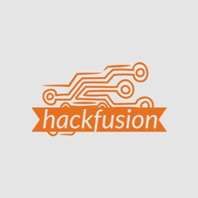

# HackFusion :shield:

Welcome to HackFusion! :rocket:

HackFusion is an innovative organization dedicated to enhancing cybersecurity through education and comprehensive solutions. 🔒 We believe in empowering individuals with the knowledge and tools necessary to protect themselves and their digital assets from cyber threats.

## About Us 📝

At HackFusion, we strive to create a community of cybersecurity enthusiasts who are passionate about learning and sharing their knowledge. We offer a wide range of educational resources, workshops, and training programs to help individuals develop their skills in ethical hacking, penetration testing, secure coding, and more.

## Our Mission 🎯

Our mission is to bridge the gap between cybersecurity professionals and the general public by providing accessible and engaging learning experiences. Through our initiatives, we aim to raise awareness about the importance of cybersecurity and empower individuals to take control of their online safety.

## What We Offer 💻

- 🎓 Educational resources and tutorials
- 🔧 Hands-on workshops and training programs
- 💡 Innovative solutions for cybersecurity challenges
- 💬 Community forums for knowledge sharing
- 🌍 Collaborative projects with like-minded organizations
- 📚 Recommended reading materials and online courses

## Get Involved 👥

We welcome individuals of all skill levels who are interested in cybersecurity. Whether you're a beginner looking to get started or an experienced professional seeking advanced training, HackFusion has something for you. Join our community and embark on an exciting journey to master the art of cybersecurity.

## Connect with Us 🌐

- ✉️ Email: themehakcodes.business@gmail.com
- 🐦 Twitter: [@HackFusion](https://twitter.com/HackFusion)
- 🔗 GitHub: [github.com/HackFusion](https://github.com/HackFusion)

Join us in our mission to make the digital world a safer place for everyone! 🔐 Together, we can achieve cybersecurity excellence. 💪
